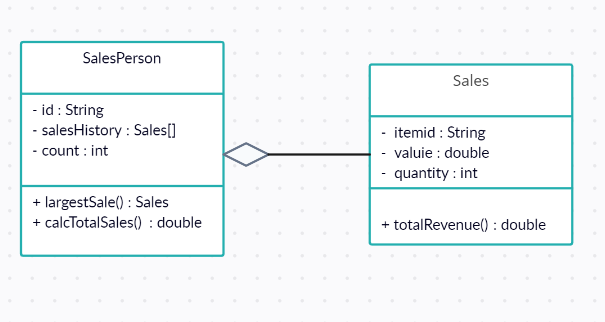
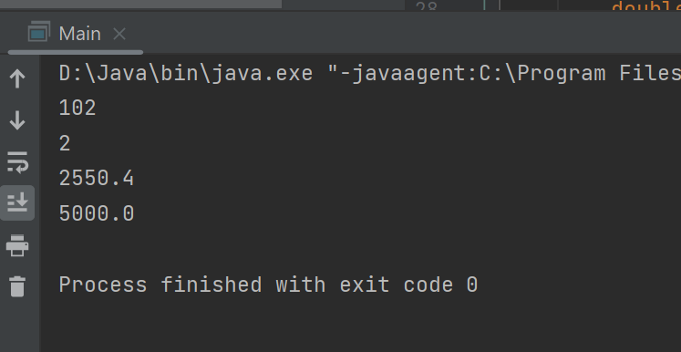

# Forum Activity: Class Design and Implementation Case
To do:

1. Give answers to what is being asked for.

2. Implement the SalesPerson and Sales class, in addition, create a Driver class to simulate and test the validity of your code.

3. Upload all answers in your GitHub repo and share it as your reply to this thread.

---

A large company with locations in different cities has taken an OOP approach in creating an administration program that manages all aspects of its business. These aspects include:

- the sale of all the different products that the company manages

- the salaries for managers, office staff and sales personnel.

 

### 1.(a) By making use of an example from the above scenario, distinguish between a class and an instantiation of a class. (3 points)

- a class is like a blueprint that define the common properties and behaviours of an object. for example a product are created to be a class, then the common properties and bahviour will be name, price and availibility.
- however an instantiation of a class is a specific class that created based on the class definition itself.

### (b) By giving two examples, explain how the principles of inheritance can be incorporated into the design of this administration program. (4 points)

-inheritance of GUI: since each site will be the same with all the model that will be used in the company, we can make a parent class to represent the common GUI.
-inheritance for employee salary: by using inheritance heirarchy, A base class like "Employee" can define common salary calculation methods and attributes, and then subclasses like "Manager," "OfficeStaff," and "SalesPersonnel" can inherit from the base class.

### (c) Describe how the use of libraries can facilitate the development of programs like this company’s administration program. (3 points)
-Reusable code and functionality
-Specialized functionality
-Community support and updates

---

### 2\. The company employs several sales personnel to sell its products to different retailers. Each branch of the company keeps track of its own sales with a suite of programs that include the two classes SalesPerson and Sales.
 
### (a) Complete the constructor public SalesPerson(String id), from the SalesPerson class. (2 points)
```
...
public SalesPerson(String id){
        this.id = id;
        this.salesHistory = new Sales[100];
        this.count = 0;
    }
...
```
### (b) Explain why accessor methods are necessary for the SalesPerson class. (3 points)

- it is necessary because the code can only be access by the salesperson therefore to protect the security of the company the accessor is being set to private.

### (c) (i) Construct unified modelling language (UML) diagrams to clearly show the relationship between the SalesPerson and Sales classes.



### (c) (ii) Outline a negative effect that a future change in the design of the Sales object might have on this suite of programs. (2 points)

- the negative effect if one of the classes are modified than the other class that are connected to the class have to be modified as well because it can be a problem to the code.

### (d) State the output after running this code. (4 points)



### (e) Construct the method calcTotalSales(), in the SalesPerson class that calculates the total value of the sales for a specific SalesPerson object. (5 points)
```
...
public double calcTotalSales(){
        double totalSales = 0.0;
        for (int i = 0; i < count; i++) {
            totalSales += salesHistory[i].getValue() * salesHistory[i].getQuantity();
        }
        return totalSales;
    }
...
```
### (f) By making use of any previously written methods, construct the method highest(), that returns the ID of the salesperson whose sales have the largest total value. (5 points)
```
...
public static String highest(SalesPerson[] salesPeople) {
        double maxTotalSales = 0.0;
        String highestSalesPersonId = "";
        for (SalesPerson salesPerson : salesPeople) {
            double totalSales = salesPerson.calcTotalSales();
            if (totalSales > maxTotalSales) {
                maxTotalSales = totalSales;
                highestSalesPersonId = salesPerson.getId();
            }
        }
        return highestSalesPersonId;
    }
...
```
### (g) Construct the method addSales(Sales s, String id), in the Driver class, that will add a new Sales object s, to the salesperson with a specified ID.
```
...
public static void addSales(Sales s, String id, SalesPerson[] salesPeople) {
        for (SalesPerson salesPerson : salesPeople) {
            if (salesPerson.getId().equals(id)) {
                salesPerson.setSalesHistory(s);
                break;
            }
        }
    }
...
```
